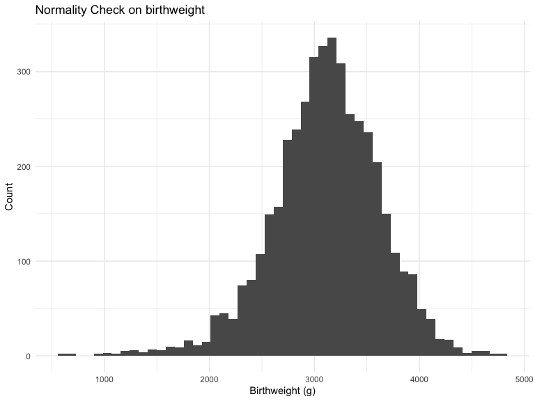
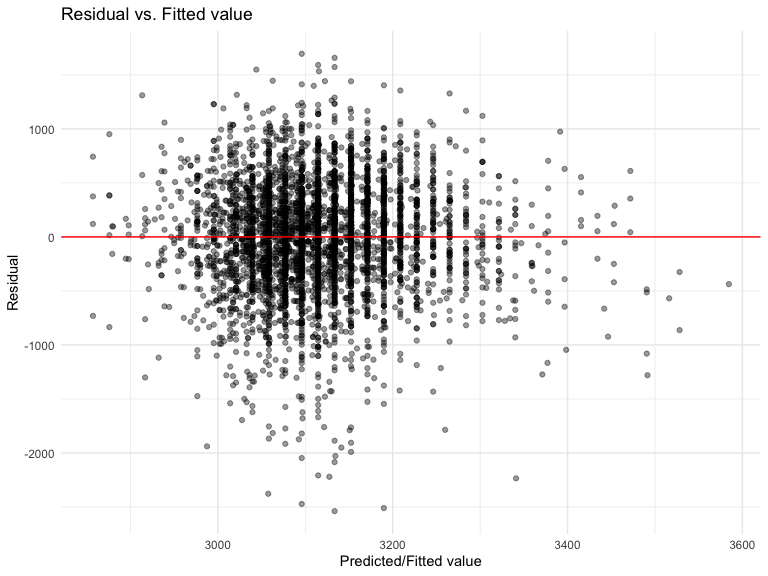
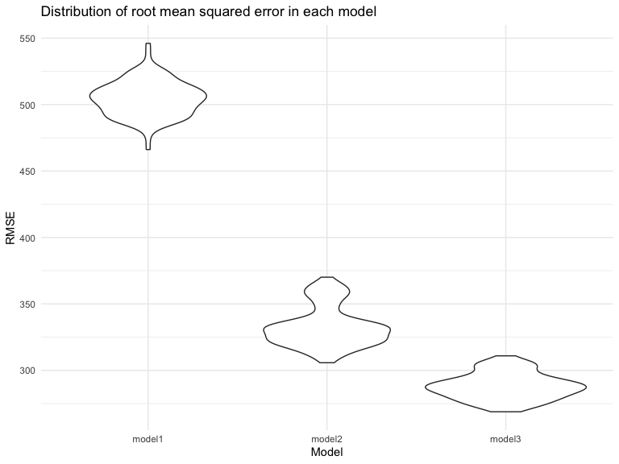

HW6
================
Duzhi Zhao
11/18/2019

# Problem 1

``` r
# Import and tidy dataset
birth_w = read.csv("./data/birthweight.csv") %>% 
  janitor::clean_names() %>% 
  # Change variable type from numeric to ordered factor
  mutate(
    babysex = ordered(babysex, levels = c(1, 2)),
    frace = ordered(frace, levels = c(1, 2, 3, 4, 8)),
    malform = ordered(malform, levels = c(0, 1)),
    mrace = ordered(mrace, levels = c(1, 2, 3, 4))
  ) %>% 
  # Recode variables with direct information
  mutate(
    babysex = recode(babysex, 
                     `1` = "male",
                     `2` = "female"),
    frace = recode(frace, 
                   `1` = "White",
                   `2` = "Black",
                   `3` = "Asian",
                   `4` = "Puerto Rican",
                   `8` = "Other"),
    malform = recode(malform, 
                     `0` = "absent",
                     `1` = "present"),
    mrace = recode(mrace,
                   `1` = "White",
                   `2` = "Black",
                   `3` = "Asian",
                   `4` = "Puerto Rican")
  )

# Check missing value
summary(is.na(birth_w)) # all have FALSE: 4342 --> NO MISSING VALUE
```

    ##   babysex          bhead          blength           bwt         
    ##  Mode :logical   Mode :logical   Mode :logical   Mode :logical  
    ##  FALSE:4342      FALSE:4342      FALSE:4342      FALSE:4342     
    ##    delwt          fincome          frace          gaweeks       
    ##  Mode :logical   Mode :logical   Mode :logical   Mode :logical  
    ##  FALSE:4342      FALSE:4342      FALSE:4342      FALSE:4342     
    ##   malform         menarche        mheight          momage       
    ##  Mode :logical   Mode :logical   Mode :logical   Mode :logical  
    ##  FALSE:4342      FALSE:4342      FALSE:4342      FALSE:4342     
    ##    mrace           parity         pnumlbw         pnumsga       
    ##  Mode :logical   Mode :logical   Mode :logical   Mode :logical  
    ##  FALSE:4342      FALSE:4342      FALSE:4342      FALSE:4342     
    ##    ppbmi            ppwt           smoken          wtgain       
    ##  Mode :logical   Mode :logical   Mode :logical   Mode :logical  
    ##  FALSE:4342      FALSE:4342      FALSE:4342      FALSE:4342

``` r
# Check normality of bwt data
birth_w %>% 
  ggplot(aes(x = bwt)) +
  geom_histogram(bins = 50) +
  labs(x = "Birthweight (g)",
       y = "Count",
       title = "Normality Check on birthweight")
```



**Comments:**  
Birthweight data is approximately following a normal distribution. No
transformation is needed in this case.

``` r
# Multiple linear regression: 
# Predictor var 1: average number of cigarettes smoked per day during pregnancy
# Predictor var 2: mother's age at delivery
# Outcome var: birthweight

fit1 = lm(bwt ~ smoken + momage, data = birth_w)
summary(fit1)
```

    ## 
    ## Call:
    ## lm(formula = bwt ~ smoken + momage, data = birth_w)
    ## 
    ## Residuals:
    ##      Min       1Q   Median       3Q      Max 
    ## -2538.53  -288.95    22.05   325.09  1695.05 
    ## 
    ## Coefficients:
    ##             Estimate Std. Error t value Pr(>|t|)    
    ## (Intercept) 2757.689     40.916  67.399  < 2e-16 ***
    ## smoken        -5.971      1.039  -5.747 9.68e-09 ***
    ## momage        18.792      1.985   9.469  < 2e-16 ***
    ## ---
    ## Signif. codes:  0 '***' 0.001 '**' 0.01 '*' 0.05 '.' 0.1 ' ' 1
    ## 
    ## Residual standard error: 505.6 on 4339 degrees of freedom
    ## Multiple R-squared:  0.02585,    Adjusted R-squared:  0.0254 
    ## F-statistic: 57.57 on 2 and 4339 DF,  p-value: < 2.2e-16

``` r
fit1 %>% 
  broom::tidy() %>% 
  mutate(term = str_replace(term, "^smoken", "Average number of cigarettes smoked per day")) %>%
  mutate(term = str_replace(term, "^momage", "Mother's age at delivery")) %>% 
  knitr::kable(digits = 3)
```

| term                                        | estimate | std.error | statistic | p.value |
| :------------------------------------------ | -------: | --------: | --------: | ------: |
| (Intercept)                                 | 2757.689 |    40.916 |    67.399 |       0 |
| Average number of cigarettes smoked per day |  \-5.971 |     1.039 |   \-5.747 |       0 |
| Mother’s age at delivery                    |   18.792 |     1.985 |     9.469 |       0 |

**Comments:**  
The multiple linear regression mode that I am interested in is how the
average number of cigarettes smoked by the pregnant women per day
(‘smoken’) and their age at delivery (‘momage’) predict the baby’s
birth weight (‘bwt’).  
Results show that for every unit increase in the average number of
cigarettes smoked per day during pregnancy, baby’s birthweight decreases
by 5.971 g, adjusting for mother’s age at delivery. For every unit
increase in mother’s age at delivery, baby’s birthweight increases by
18.792 g, adjusting for average number of cigarettes smoked per day
during pregnancy. The low adjusted R-squared (0.0254) shows that only
2.54 % of the variation in the outcome variable can be explained by the
predictor variables, adjusting for the number of predictors.

``` r
# Add residuals and predictions (fitted values) into dataset 'birth_w'
bwt_resid_pred = 
  birth_w %>% 
  add_residuals(fit1) %>% 
  add_predictions(fit1)

# Plot: Residual vs. Fitted value 
bwt_resid_pred %>% 
  ggplot(aes(x = pred, y = resid)) +
  geom_point(alpha = 0.4) + 
  geom_abline(intercept = 0, slope = 0, color = "red") +
  labs(x = "Predicted/Fitted value",
      y = "Residual",
      title = "Residual vs. Fitted value")
```



**Comments:**  
The residual vs. Fitted value plot shows a random pattern with evenly
distributed value around the zero line, indicating equal error variance.

``` r
# MLR
# Predictor 1: baby's length at birth
# Predictor 2: gestational age in weeks
# Outcome: birthweight

fit2 = lm(bwt ~ blength + gaweeks, data = birth_w)
summary(fit2)
```

    ## 
    ## Call:
    ## lm(formula = bwt ~ blength + gaweeks, data = birth_w)
    ## 
    ## Residuals:
    ##     Min      1Q  Median      3Q     Max 
    ## -1709.6  -215.4   -11.4   208.2  4188.8 
    ## 
    ## Coefficients:
    ##              Estimate Std. Error t value Pr(>|t|)    
    ## (Intercept) -4347.667     97.958  -44.38   <2e-16 ***
    ## blength       128.556      1.990   64.60   <2e-16 ***
    ## gaweeks        27.047      1.718   15.74   <2e-16 ***
    ## ---
    ## Signif. codes:  0 '***' 0.001 '**' 0.01 '*' 0.05 '.' 0.1 ' ' 1
    ## 
    ## Residual standard error: 333.2 on 4339 degrees of freedom
    ## Multiple R-squared:  0.5769, Adjusted R-squared:  0.5767 
    ## F-statistic:  2958 on 2 and 4339 DF,  p-value: < 2.2e-16

``` r
# MLR - three-way interaction effect
# Predictor 1: baby’s head circumference at birth (centimeters)
# Predictor 2: baby's length at birth
# Predictor 3: baby's sex
# Outcome: birthweight

fit3 = lm(bwt ~ bhead * blength * babysex, data = birth_w)
summary(fit3)
```

    ## 
    ## Call:
    ## lm(formula = bwt ~ bhead * blength * babysex, data = birth_w)
    ## 
    ## Residuals:
    ##      Min       1Q   Median       3Q      Max 
    ## -1132.99  -190.42   -10.33   178.63  2617.96 
    ## 
    ## Coefficients:
    ##                           Estimate Std. Error t value Pr(>|t|)    
    ## (Intercept)             -3989.3828   838.8835  -4.756 2.04e-06 ***
    ## bhead                      82.5990    25.5458   3.233 0.001233 ** 
    ## blength                    40.2405    17.5593   2.292 0.021971 *  
    ## babysex.L                4507.7126  1186.3604   3.800 0.000147 ***
    ## bhead:blength               1.3854     0.5283   2.622 0.008764 ** 
    ## bhead:babysex.L          -140.2852    36.1273  -3.883 0.000105 ***
    ## blength:babysex.L         -87.5206    24.8326  -3.524 0.000429 ***
    ## bhead:blength:babysex.L     2.7422     0.7471   3.670 0.000245 ***
    ## ---
    ## Signif. codes:  0 '***' 0.001 '**' 0.01 '*' 0.05 '.' 0.1 ' ' 1
    ## 
    ## Residual standard error: 287.7 on 4334 degrees of freedom
    ## Multiple R-squared:  0.6849, Adjusted R-squared:  0.6844 
    ## F-statistic:  1346 on 7 and 4334 DF,  p-value: < 2.2e-16

``` r
set.seed(20)

# Cross validating
cv_birthw = crossv_mc(birth_w, 100)
```

``` r
# Fitting models
cv_results =
  cv_birthw %>% 
  mutate(
    model1 = map(.x = train, ~lm(bwt ~ smoken + momage, data = .x)),
    rmse_model1 = map2_dbl(.x = model1, .y = test, ~rmse(.x, .y)),
    
    model2 = map(.x = train, ~lm(bwt ~ blength + gaweeks, data = .x)),
    rmse_model2 = map2_dbl(.x = model2, .y = test, ~rmse(.x, .y)),
    
    model3  = map(train, ~lm(bwt ~ bhead * blength * babysex, data = .x)),
    rmse_model3 = map2_dbl(model3, test, ~rmse(model = .x, data = .y))          
  )
```

``` r
# Visualize cross-validation
cv_results %>% 
  select(starts_with("rmse")) %>% 
  pivot_longer(
    everything(),
    names_to = "model", 
    values_to = "rmse",
    names_prefix = "rmse_") %>% 
  mutate(model = fct_inorder(model)) %>% 
  ggplot(aes(x = model, y = rmse)) + 
  geom_violin() +
  labs(x = "Model",
       y = "RMSE",
       title = "Distribution of root mean squared error in each model")
```



``` r
# Show average RMSE for each model
cv_results %>% 
  select(starts_with("rmse")) %>% 
  mutate(
    avg_rmse_1 = mean(rmse_model1),
    avg_rmse_2 = mean(rmse_model2),
    avg_rmse_3 = mean(rmse_model3)
  ) %>% 
  select(4:6) %>% 
  distinct() %>% 
  pivot_longer(
    everything(),
    names_to = "Model",
    names_prefix = "avg_rmse_",
    values_to = "Average RMSE"
  ) %>% 
  knitr::kable(digits = 1)
```

| Model | Average RMSE |
| :---- | -----------: |
| 1     |        504.5 |
| 2     |        332.9 |
| 3     |        288.0 |

**Comments:**  
Based on the violin plot and the calculated average root mean squared
error (RMSE), the MLR that includes head circumference, length, sex, and
all interactions as predictors (model 3) has the lowest average RMSE
(288.0).
