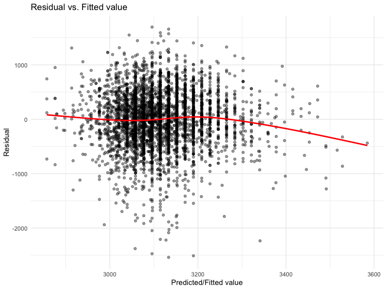

HW6
================
Duzhi Zhao
11/18/2019

# Problem 1

``` r
# Import and tidy dataset
birth_w = read.csv("./data/birthweight.csv") %>% 
  janitor::clean_names() %>% 
  # Change variable type from numeric to ordered factor
  mutate(
    babysex = ordered(babysex, levels = c(1, 2)),
    frace = ordered(frace, levels = c(1, 2, 3, 4, 8)),
    malform = ordered(malform, levels = c(0, 1)),
    mrace = ordered(mrace, levels = c(1, 2, 3, 4))
  ) %>% 
  # Recode variables with direct information
  mutate(
    babysex = recode(babysex, 
                     `1` = "male",
                     `2` = "female"),
    frace = recode(frace, 
                   `1` = "White",
                   `2` = "Black",
                   `3` = "Asian",
                   `4` = "Puerto Rican",
                   `8` = "Other"),
    malform = recode(malform, 
                     `0` = "absent",
                     `1` = "present"),
    mrace = recode(mrace,
                   `1` = "White",
                   `2` = "Black",
                   `3` = "Asian",
                   `4` = "Puerto Rican")
  )

# Check missing value
summary(is.na(birth_w)) # all have FALSE: 4342 --> NO MISSING VALUE
```

    ##   babysex          bhead          blength           bwt         
    ##  Mode :logical   Mode :logical   Mode :logical   Mode :logical  
    ##  FALSE:4342      FALSE:4342      FALSE:4342      FALSE:4342     
    ##    delwt          fincome          frace          gaweeks       
    ##  Mode :logical   Mode :logical   Mode :logical   Mode :logical  
    ##  FALSE:4342      FALSE:4342      FALSE:4342      FALSE:4342     
    ##   malform         menarche        mheight          momage       
    ##  Mode :logical   Mode :logical   Mode :logical   Mode :logical  
    ##  FALSE:4342      FALSE:4342      FALSE:4342      FALSE:4342     
    ##    mrace           parity         pnumlbw         pnumsga       
    ##  Mode :logical   Mode :logical   Mode :logical   Mode :logical  
    ##  FALSE:4342      FALSE:4342      FALSE:4342      FALSE:4342     
    ##    ppbmi            ppwt           smoken          wtgain       
    ##  Mode :logical   Mode :logical   Mode :logical   Mode :logical  
    ##  FALSE:4342      FALSE:4342      FALSE:4342      FALSE:4342

``` r
# Check normality of bwt data
birth_w %>% 
  ggplot(aes(x = bwt)) +
  geom_histogram(bins = 50) +
  labs(x = "Birthweight (g)",
       y = "Count",
       title = "Normality Check on birthweight")
```


**Comments:**  
Birthweight data is approximately following a normal distribution. No
transformation is needed in this case.

``` r
# MLR - 'smoken' and 'momage' as predictors
fit = lm(bwt ~ smoken + momage, data = birth_w)
summary(fit)
```

    ## 
    ## Call:
    ## lm(formula = bwt ~ smoken + momage, data = birth_w)
    ## 
    ## Residuals:
    ##      Min       1Q   Median       3Q      Max 
    ## -2538.53  -288.95    22.05   325.09  1695.05 
    ## 
    ## Coefficients:
    ##             Estimate Std. Error t value Pr(>|t|)    
    ## (Intercept) 2757.689     40.916  67.399  < 2e-16 ***
    ## smoken        -5.971      1.039  -5.747 9.68e-09 ***
    ## momage        18.792      1.985   9.469  < 2e-16 ***
    ## ---
    ## Signif. codes:  0 '***' 0.001 '**' 0.01 '*' 0.05 '.' 0.1 ' ' 1
    ## 
    ## Residual standard error: 505.6 on 4339 degrees of freedom
    ## Multiple R-squared:  0.02585,    Adjusted R-squared:  0.0254 
    ## F-statistic: 57.57 on 2 and 4339 DF,  p-value: < 2.2e-16

``` r
fit %>% 
  broom::tidy() %>% 
  mutate(term = str_replace(term, "^smoken", "No. of cigarettes smoked per day")) %>%
  mutate(term = str_replace(term, "^momage", "Mother's age at delivery")) %>% 
  knitr::kable(digits = 3)
```

| term                             | estimate | std.error | statistic | p.value |
| :------------------------------- | -------: | --------: | --------: | ------: |
| (Intercept)                      | 2757.689 |    40.916 |    67.399 |       0 |
| No. of cigarettes smoked per day |  \-5.971 |     1.039 |   \-5.747 |       0 |
| Mother’s age at delivery         |   18.792 |     1.985 |     9.469 |       0 |

**Comments:**  
The multiple linear regression mode that I am interested in is how the
average number of cigarettes smoked by the pregnant women per day
(‘smoken’) and their age at delivery (‘momage’) predict the baby’s
birth weight (‘bwt’).

``` r
# Add residuals and predictions (fitted values) into dataset 'birth_w'
bwt_resid_pred = 
  birth_w %>% 
  modelr::add_residuals(fit) %>% 
  modelr::add_predictions(fit)

# Plot: Residual vs. Fitted value 
bwt_resid_pred %>% 
  ggplot(aes(x = pred, y = resid)) +
  geom_point(alpha = 0.4) + 
  geom_abline(intercept = 0, slope = 0, color = "red") +
  labs(x = "Predicted/Fitted value",
      y = "Residual",
      title = "Residual vs. Fitted value")
```



**Comments:**  
The residual vs. Fitted value plot shows a random pattern with evenly
distributed value around the zero line, indicating equal error variance.
